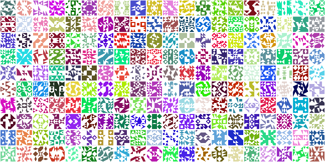

# identiconr


[](https://travis-ci.org/sherrillmix/identiconr)
[](https://codecov.io/github/sherrillmix/identiconr?branch=master)

##Install

An R library to generate random identicon patterns. To install directly from github, use the [<code>devtools</code>](https://github.com/hadley/devtools) library and run:

devtools::install_github("sherrillmix/identiconr")

```r
devtools::install_github("sherrillmix/identiconr")
```
Then load the library as normal using:

```r
library(identiconr)
```

## Main functions
### plotIdenticon

<code>plotIdenticon(seqs)</code> takes the output from <code>generateIdenticon</code> (or a seed directly) and plots them to the current device. For example:


```r
plotIdenticon(generateIdenticon("test@email.com"))
```


```r
plotIdenticon(seed = "abc")
```


```r
plotIdenticon(seed = "abc", col = "red", back = "blue")
```


```r
plotIdenticon(seed = "abc", nSquare = 3)
```


```r
plotIdenticon(seed = "abc", nSquare = 5)
```


```r
par(mfrow = c(10, 20), mar = rep(0.1, 4))
for (ii in 1:200) plotIdenticon(nSquare = 3)
```




### generateIdenticon 

<code>generateIdenticon(seqs)</code> takes an integer or character seed and generates a corresponding assortment of shapes and colors. For example:


```r
generateIdenticon("test@email.com")
```

```
## $types
##      id shape invert     col    back rotate
## 2 2 2 2    20  FALSE #45F1D9   white      4
## 1 2 1 2    29  FALSE #45F1D9   white      3
## 2 1 2 1    36   TRUE   white #45F1D9      4
## 1 1 1 1    24  FALSE #45F1D9   white      2
## 
## $centers
##    id x y type rot
## 1   1 1 1  2 2   0
## 2   2 2 1  1 2   0
## 3   3 3 1  1 2   1
## 4   4 4 1  2 2   1
## 5   5 1 2  2 1   0
## 6   6 2 2  1 1   0
## 7   7 3 2  1 1   1
## 8   8 4 2  2 1   1
## 9   9 1 3  2 1   3
## 10 10 2 3  1 1   3
## 11 11 3 3  1 1   2
## 12 12 4 3  2 1   2
## 13 13 1 4  2 2   3
## 14 14 2 4  1 2   3
## 15 15 3 4  1 2   2
## 16 16 4 4  2 2   2
## 
## $nSquare
## [1] 4
```

This isn't particularly useful by itself and will probably only be used with `plotIdenticon()` but is provided for any extensions or manual adjustment.

See [the vignette](doc/example.pdf) for complete plotting details.

